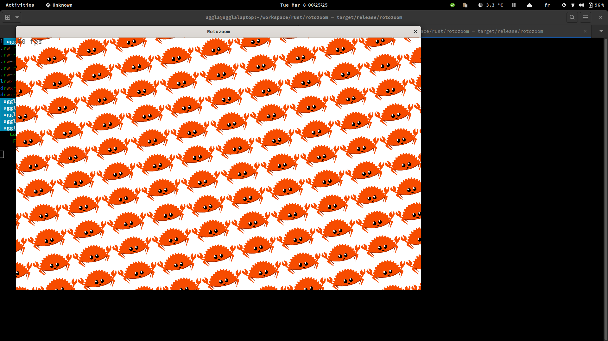
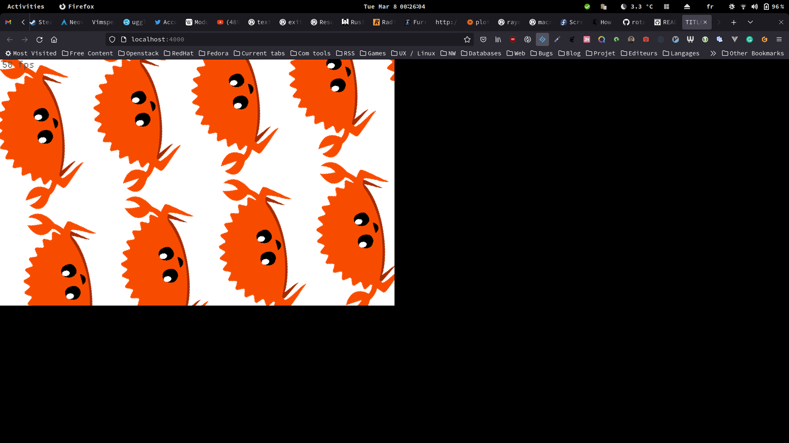

# rotozoom

A naive  rotozoom with macroquad
* Compute a 2D Texture to create a rotozoom the old school way.
* No usage of camera or texture rotation.

## Authors

- [@Uggla](https://www.github.com/Uggla)

## Screenshots

Native application:


Running the wasm application into Firefox:



## Binaries
Binaries are available here:
[Binary releases](https://github.com/uggla/rotozoom/releases)

## Run Locally (mainly for development purposes)

1. Clone the project

```bash
  git clone https://github.com/uggla/rotozoom
```

2. Go to the project directory

```bash
  cd rotozoom
```

#### Native
1. Install Rust following the instructions [here](https://www.rust-lang.org/fr/learn/get-started).

   *Tips: the rustup method is the simplest one.*

2. Install required library for macroquad

* Ubuntu system dependencies
```bash
apt install pkg-config libx11-dev libxi-dev libgl1-mesa-dev libasound2-dev
```

* Fedora system dependencies
```bash
dnf install libX11-devel libXi-devel mesa-libGL-devel alsa-lib-devel
```

* Windows system
```
No dependencies are required for Windows or MacOS
```

3. Run the native client
```bash
cargo run --release
```

#### Wasm32

1. Follow the above instruction of the native client.

2. Install basic-http-server
```bash
cargo install basic-http-server
```

3. Add the wasm32 compilation target
```bash
rustup target add wasm32-unknown-unknown
```

4. Go to the client directory and run the native client
```bash
cargo build --target wasm32-unknown-unknown --release
```

5. Serve the files and open the browser
```bash
basic-http-server
xdg-open http://127.0.0.1:4000
```
